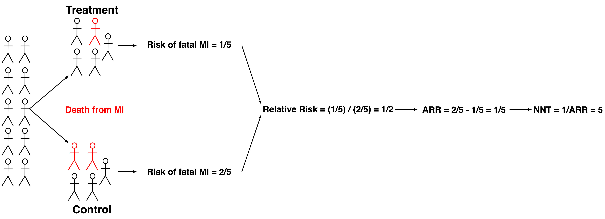

```{r setup, include=FALSE}
knitr::opts_chunk$set(echo = FALSE, warning = FALSE, message = FALSE)
library(ggplot2)
library(metafor)
library(dplyr)
library(tidyr)
library(xaringanthemer)

style_mono_accent(base_font_size = '16px')
```

class: middle

# Agenda

**Epidemiology 1 - times**
<br>
1. Must Know - ? minutes
<br><br>
2. Study Bias - 10 minutes
<br><br>
3. Repeat Some Statistics - ? minutes
<br><br>
4. Brief Overview of Stats for Last Time - 5 minutes
<br><br>
5. Types of Studies and Associated Stats - 15 minutes
<br><br>
6. Limitations of Each Study - 10 minutes

---

class: middle

# Must Know
--
<br>
- **Internal Validity**
--
  - Results of a study represent the truth of the study population
--
<br><br>
- **External Validity**
--
  - Results of a study apply to populations that aren't studied

---

class: middle, center

# Types of Biases - My groupings

---

class: middle

# Biases of design or unseen variables

- **Selection bias**
  - Non-random partitioning of individuals into groups
--

- **Observer-expectancy**
  - Observer is unblinded and expects a particular outcome
--

- **Effect modification bias**
  - Magnitude of effect varies by third variable
  - __Can__ be eliminated by stratification
--

- **Confounding**
  - Unseen third variable is an underlying cause for correlation of two other variables
  - __Cannot__ be eliminated by stratification

---

class: middle

# Biases of information (measurement)

--
- **Recall bias**
  - Subjects with disease can recall exposures better than healthy subjects
--

- **Procedure bias**
  - Experimenters vary systematically in the way they do work
  - e.g. Experimenters don't follow the specified procedure
--

- **Instrument bias**
  - Instrument is broken
  - Instruments can also be things like surveys or __clerkship evaluations__
  - Just means instrument is not reliable

---

class: middle

# Biases of time and completion

- **Lead-time bias**
  - New test detects disease earlier
  - Survival appears improved with new test
--

- **Attrition bias**
  - Subjects systematically withdraw
  - Could be things like side effects or lack of improvement
--

- **Loss-to-follow up**
  - Subjects randomly do not report for scheduled followup

---

class: middle, center

# Repeat Some Statistical Things

---

class: middle, center

# Risk Ratio (RR)
**Only use on random samples**

```{r risk-ratio, fig.height=4, fig.width=6}
# Example data
dat <- data.frame(Group = factor(c("Exposed", "Non-Exposed"), levels = c("Exposed", "Non-Exposed")),
                  Disease = c(30, 20),
                  No_Disease = c(70, 80)) 
dat$Total <- dat$Disease + dat$No_Disease

# Calculate Risk Ratio
RR <- (dat$Disease[1] / dat$Total[1]) / (dat$Disease[2] / dat$Total[2])

# Calculate CI
CI.h <- exp(log(RR) + 1.96*sqrt(1/dat$Disease[1] + 1/dat$Disease[2] + 1/(dat$Disease[1] + dat$No_Disease[1]) - 1/(dat$Disease[2] + dat$No_Disease[2])))
CI.l <- exp(log(RR) - 1.96*sqrt(1/dat$Disease[1] + 1/dat$Disease[2] - 1/(dat$Disease[1] + dat$No_Disease[1]) - 1/(dat$Disease[2] + dat$No_Disease[2])))
```

.pull-left[
```{r, results='asis'}
cat('
<table>
<tr><th align="left"></th><th align="right">Disease</th><th align="right">No Disease</th><th align="right">Total</th></tr>
<tr><td align="left">Exposed</td><td align="right">30</td><td align="right">70</td><td align="right">100</td></tr>
<tr><td align="left">Not Exposed</td><td align="right">20</td><td align="right">80</td><td align="right">100</td></tr>
<tr><td align="left">Total</td><td align="right">50</td><td align="right">150</td><td align="right">200</td></tr>
</table>
')
```
]

.pull-right[
.left[
$R_E = \frac{D_E}{D_E + ND_E} = \frac{30}{30 + 70} = 0.3$<br><br>
$R_{NE} = \frac{D_{NE}}{D_{NE} + ND_{NE}} = \frac{20}{20 + 80} = 0.2$<br><br>
$RR = \frac{R_E}{R_{NE}} = \frac{0.3}{0.2} =$ **`r RR`**
]
]

---

class: middle, center

# Risk Difference (RD)...<br> Absolute Risk Reduction (ARR)

```{r risk-difference, fig.height=4, fig.width=6}
# Calculate Risk Difference
RD <- (dat$Disease[1] / dat$Total[1]) - (dat$Disease[2] / dat$Total[2])
```

.pull-left[
```{r, results='asis'}
cat('
<table>
<tr><th align="left"></th><th align="right">Disease</th><th align="right">No Disease</th><th align="right">Total</th></tr>
<tr><td align="left">Exposed</td><td align="right">30</td><td align="right">70</td><td align="right">100</td></tr>
<tr><td align="left">Not Exposed</td><td align="right">20</td><td align="right">80</td><td align="right">100</td></tr>
<tr><td align="left">Total</td><td align="right">50</td><td align="right">150</td><td align="right">200</td></tr>
</table>
')
```
]

.pull-right[
.left[
$R_E = \frac{D_E}{D_E + ND_E} = \frac{30}{30 + 70} = 0.3$<br><br>
$R_{NE} = \frac{D_{NE}}{D_{NE} + ND_{NE}} = \frac{20}{20 + 80} = 0.2$<br><br>
$ARR = RD = R_E - R_{NE} = 0.3 - 0.2 =$ **`r RD`**
]
]

---

class: middle, center

# Number Needed to Harm or Treat<br>(NNH or NNT)

```{r nnt, fig.height=4, fig.width=6}
# Calculate Number Needed to Treat
NNT <- 1 / abs(RD)
```

.pull-left[
<br>
```{r, results='asis'}
cat('
<table>
<tr><th align="left"></th><th align="right">Disease</th><th align="right">No Disease</th><th align="right">Total</th></tr>
<tr><td align="left">Exposed</td><td align="right">30</td><td align="right">70</td><td align="right">100</td></tr>
<tr><td align="left">Not Exposed</td><td align="right">20</td><td align="right">80</td><td align="right">100</td></tr>
<tr><td align="left">Total</td><td align="right">50</td><td align="right">150</td><td align="right">200</td></tr>
</table>
')
```
]

.pull-right[
.left[
$R_E = \frac{D_E}{D_E + ND_E} = \frac{30}{30 + 70} = 0.3$<br><br>
$R_{NE} = \frac{D_{NE}}{D_{NE} + ND_{NE}} = \frac{20}{20 + 80} = 0.2$<br><br>
$RD = R_E - R_{NE} = 0.3 - 0.2 = 0.1$<br><br>
$NNH = \frac{1}{RD} = \frac{1}{ARR} = \frac{1}{0.1} =$ **`r NNT`**
]
]

---

class: middle, center

# Types of Studies

---

class: middle, center

# The pyramid of evidence is a hierarchy


--- 

class: middle, center

# Experimental Trials

---

class: middle, center

# Randomized control trial is in the name



---

class: middle

# Randomized control - gold standard

--

- This is widely considered the gold standard for clinical evidence
--
<br><br>
- Question: __Primary__ purpose of randomization?
--

- Answer: To eliminate __selection bias__
  - Selection bias (at the time of randomization) is eliminated if randomization is technically correct
--

<br><br>
- Question: Secondary goal of randomization?
--

- Answer: To help with confounding
  - Confounders are not necessarily eliminated even with perfect technical execution
--
<br><br>
- Can use relative risk because investigator knows prevalence of disease and prior exposures

---

class: middle

# Crossover trial - groups switch


<br>
- This post hoc analysis is overly simplified for real life
 
- This understanding is sufficient for boards
 
- Includes initial randomization

- Also, confounders reduced because a patient can serve as their own control

---

class: middle, center

# Observational Studies

---

class: middle

# Prospective cohorts - into the future


---


class: middle

# Retrospective cohorts - from the past


---

class: middle

# Cohorts form the next level of evidence
 
--

- Can use relative risk because investigator knows prevalence of exposure and disease
- Subjects vary by exposure status
- Can calculate incidence
--

- __Selection bias__ is the biggest problem
  - Investigator has infinite control over inclusion
--

- Other biases
  - Attrition, loss-to-follow up, confounding, Hawthorne
--

- Retrospective
  - Information bias

---

class: middle, center

# Case-control trials measure chance of exposure given disease


---

class: middle

# Case-control forms the next level down from cohorts
--

- Must use odds ratio because investigator does not know prevalence of disease
--
- Subjects grouped by cases and controls
  - Measure __odds of exposure__ in case and control groups
--
- Significantly improved power and decreased resource requirements compared to cohorts 
  - Due to cases being selected at out set
--
- __Selection and Recall biases__ are the biggest problem
  - Selecting appropriate controls is __highly__ non-trivial
  - Sick people remember exposures (e.g. Melanoma patients stew about their sunburns)
--
  
- Also common
   - Information biases
--

- __Cannot calculate incidence or prevalence__

---

class: middle, center

# Cross-sectional trials measure exposure and disease simultaneously


---

class: middle

# Cross-sectional study - next level

--

- __Quick, cheap, and easy__
  - Typically this is a starting point
--

- Can establish prevalence of disease
--

- Must use chi-squared or correlation for statistical test
--

- Subjects can be grouped by exposure and diease in to the 2x2 contingency
--
<br><br>
- __Cannot establish causation__
--

- Cannot calculate risk metrics
 
---

class: middle, center

# The End
